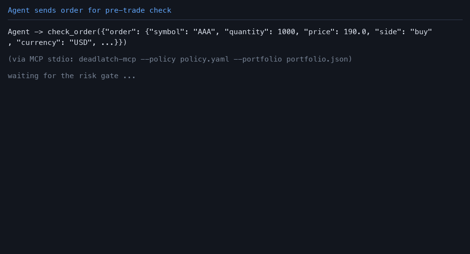

# Deadlatch

**The pre-trade latch for your trading agent.** Advisory-only.

Three things you need to know before anything else:

1. **You need an independent, cross-broker gate that you control.** If an agent can place orders on your account, the last check between the agent and the broker should not be the agent itself — and it should not be locked to one broker's UI or rules.
2. **Deadlatch does not predict, does not recommend, and does not place orders.** It answers one question only: *is this order allowed right now?* It is not a signal generator and it is not a broker.
3. **Every answer comes with reasons, evidence, and a local audit record.** PASS / WARN / BLOCK is never a bare verdict — you can see which rule hit, why, and what was evaluated, and every check is appended to a local JSONL audit log.

**Honest boundary (please read):** Deadlatch is advisory. It cannot force an agent that never calls it to call it, and it cannot stop an agent that ignores a BLOCK from submitting the order somewhere else. Whether the agent calls the guard and honors the result is the integrator's decision. Do not rely on this tool as a guarantee against loss — it is a gate, not an insurance policy.

- **License:** MIT — see [LICENSE](LICENSE).
- **中文文档:** [README.zh-CN.md](README.zh-CN.md)
- **Security:** [SECURITY.md](SECURITY.md) · **Contributing:** [CONTRIBUTING.md](CONTRIBUTING.md) · **Disclaimer:** [DISCLAIMER.md](DISCLAIMER.md)

## Start here

<!-- mcp-name: io.github.Diabloluo/deadlatch -->

The current install path is the verified
[PyPI `deadlatch==0.1.1`](https://pypi.org/project/deadlatch/0.1.1/).
This source tree is unreleased candidate `0.1.2`; it is not published.

```bash
pip install deadlatch==0.1.1
```

The published MCP Registry name is `io.github.Diabloluo/deadlatch` at version `0.1.1`.

**MCP-first start:**

```bash
uvx --from deadlatch==0.1.1 deadlatch-mcp --policy policy.yaml --portfolio portfolio.json
```

`--policy` and `--portfolio` are required local files. `--audit-path` and `--kill-switch-path` are optional. Use fictional or your own simulated inputs only. Deadlatch is advisory-only: it never places orders and cannot stop an agent that never calls it. Option orders must use the broker's unique full contract code as `symbol`. A historical GitHub pre-release remains at [v0.1.0.dev1](https://github.com/Diabloluo/deadlatch/releases/tag/v0.1.0.dev1); it is not the current install path.

Then:

1. **Run a fictional-data Quick Start** below (Python, CLI, or MCP). Confirm `PASS` → `BLOCK` → local audit.
2. **Request a 20-minute integration assessment** only if you already have an order-intent or simulated execution path: [open the assessment form](https://github.com/Diabloluo/deadlatch/issues/new?template=integration-assessment.yml).

That GitHub issue is **public**. Do not paste accounts, positions, orders, API keys, tokens, customer names, or private paths. Security defects must go through [GitHub Security Advisories](https://github.com/Diabloluo/deadlatch/security/advisories), not a public issue.

---

## Quick Start (60 seconds each)

All three quick starts use fictional data and a temporary audit path. They are executed from the same source scripts by the test suite, so they cannot drift from the documentation.

### 1. Python API

```bash
pip install dist/deadlatch-*.whl        # or: pip install -e .
python docs/quickstart/python.py
```

Shows `Guard.from_policy(...)` → `Order` / `Portfolio` → `guard.check(...)`:
a valid order returns `PASS / 0`; an oversized order returns `BLOCK / 3` with the
hit rules; on `BLOCK` the example caller stops — no broker call is ever made.

### 2. CLI

```bash
bash docs/quickstart/cli.sh                  # requires `deadlatch` on PATH
```

Creates fresh inputs in a temp directory (dynamic timestamps — never goes stale),
then runs `deadlatch check` for PASS (`exit 0`), BLOCK (`exit 3`), an input
error (`exit 4`), and a `--json` check, plus `shadow report --json` over the audit.

### 3. MCP (stdio)

```bash
python docs/quickstart/mcp_client.py         # requires `deadlatch` installed
```

Starts `deadlatch-mcp` as a real subprocess over stdio, lists the five tools,
and calls `check_order` once for PASS and once for BLOCK. `policy` / `portfolio` /
`audit` paths are **server startup configuration** — an agent cannot swap them as
tool arguments. BLOCK is a constraint the caller must honor; technically the guard
cannot force a fully bypassing agent to call it.

---

## What it is / is not

| Deadlatch **is** | Deadlatch **is not** |
|---|---|
| A local, deterministic risk gate evaluated before you submit | A signal generator, recommender, or portfolio optimizer |
| A library, a CLI, and a stdio MCP server — no broker connectivity, no policy mutation | A broker adapter, an execution engine, or a market feed |
| An auditable check: every evaluation is written to a local JSONL log | A cloud service, a database, or a telemetry sink |
| USD-only, single-leg orders, one snapshot per check (v0.1) | Multi-leg, multi-currency, Greeks/IV-aware (see limitations) |

## Who should use it

- Teams that already have an order-intent or simulated execution path and
  want an independent, deterministic pre-trade gate with a local audit trail.
- Developers who want a small, dependency-light, fail-closed building block they
  can integrate into their own execution pipeline.
- Anyone who wants to evaluate orders against a *policy they control*, expressed
  as plain YAML.

**Who should not use it:** anyone expecting a profit guarantee, a backtest engine,
a portfolio manager, or a tool that enforces itself. If the agent never calls the
guard, or ignores a BLOCK, nothing in this repository can stop it.

## Core security boundary

- **Local:** everything runs on your machine; no account credentials are ever
  stored, read, or transmitted.
- **No network core path:** the library, CLI, and MCP server never open a socket,
  never register an HTTP/SSE route, and never call out for quotes or anything else
  (the MCP SDK's HTTP stack is a transitive dependency that business code never imports).
- **Never places orders:** the core package (library, CLI, MCP server) has
  no broker connectivity and never submits orders. Experimental read-only
  mapping examples exist only in the development workspace; they are not
  included in the public candidate or the wheel, and they are not
  live-verified integrations.
- **Fail-closed:** missing or malformed data → BLOCK (`exit 3`); input/config errors →
  `exit 4`; internal errors → `exit 5`. An uncertain state is never reported as PASS.
- **Direction is snapshot-derived:** order-side text is never accepted as proof of a
  close. Stock and option closing intent is recognized only when a fresh portfolio
  snapshot contains a matching, opposite-side position with sufficient quantity.
  For options, `symbol` must be the broker's unique full contract code; never reuse
  an underlying ticker across different expiries, strikes, or rights.
- **USD-only (v0.1):** any currency mismatch (order, portfolio, positions) is an
  input error (`exit 4`); the MCP account-status tool fail-closes on mismatch.

**Write surface:** the tool never modifies `policy`, `portfolio`, or
kill-switch state, never connects to a broker, and never places an order.
Two kinds of intentional local file writes exist:

1. **Audit subsystem:** `Guard.check()` / `check_order` append one sanitized
   v2 record to a UTC day shard next to the logical audit path (30-day
   retention). Append is a bounded tail write under a shared lock; it does not
   rewrite history. A new collection needs one explicit
   `deadlatch audit init` (or `initialize_audit_state`) before append;
   Guard/MCP never auto-migrate. `deadlatch shadow report` and
   `deadlatch audit prune` delete whole shard files that fall outside the
   30-calendar-day window. `deadlatch audit repair --quarantine` still uses
   lock/tmp files and `os.replace` when it isolates a truncated tail. Ordinary
   append is not crash-atomic across files. POSIX locks are cross-process;
   Windows remains process-local.
2. **Explicit migration output:** `deadlatch migrate --output <file>`
   writes the migrated document only when you explicitly pass `--output`.

The public contract for these rules, Decimal thresholds, exit codes, and
option-symbol requirements is [docs/rules-spec.md](docs/rules-spec.md).

## The 12 rules (v0.1)

| # | Rule | What it guards |
|---|---|---|
| R1 | `kill_switch` | Global switch: `off` / `full` (block everything) / `reduce_only` (allow only inferred closing orders) |
| R2 | `input_validity` | Order passes schema, version gate, currency consistency, finite amounts (violations → `exit 4`) |
| R3 | `max_order_quantity` | Single-order quantity limit |
| R4 | `max_order_value` | Single-order notional limit (options: price × multiplier × quantity) |
| R5 | `max_symbol_exposure` | Exposure per underlying (options by strike × multiplier × quantity) |
| R6 | `max_total_exposure` | Portfolio gross exposure ratio |
| R7 | `cash_margin_check` | Post-trade cash floor and short-option margin |
| R8 | `max_daily_loss` | Daily loss ratio (PnL / day-start equity) |
| R9 | `max_drawdown` | Drawdown ratio from peak |
| R10 | `order_time_validity` | Order age / future timestamps (unparseable → fail-closed BLOCK) |
| R11 | `data_freshness` | Portfolio snapshot freshness (future snapshot → fail-closed) |
| R12 | `missing_data_fail_closed` | Missing/null/ill-formed portfolio data → `exit 3` (data unusable = risk) |

Optional rules (R3–R7) are toggled by their config keys in `policy.yaml`; a missing
optional key must be declared in `acknowledged_disabled` or the policy is rejected
(`exit 4`). Mandatory rules (R1, R2, R8–R12) can never be disabled.

## Exit codes

| Code | Meaning |
|---|---|
| `0` | PASS — the order is allowed as given |
| `2` | WARN — proceed only if your execution policy explicitly allows warnings |
| `3` | BLOCK — the order must not be submitted (risk rule or fail-closed data) |
| `4` | Input / configuration error — the caller misused the API, not a risk event |
| `5` | Internal / rule exception — treated as BLOCK (fail-closed) |

In shadow mode the internal verdict is recorded (`shadow_verdict`) while the
external projection is `PASS / 0`; kill-switch hits and `exit 4/5` are never
projected away.

## Data contracts & migration

Schemas are versioned JSON Schema 2020-12 files shipped inside the package:
`order`, `portfolio`, `policy`, `result`, `audit-record`, `shadow-report`,
`audit-maintenance-result`, `audit-prune-result`, `audit-write-state`,
`audit-state-result`.
Explicit offline migration is available for legacy documents:

```bash
deadlatch migrate --kind order    --input order_v1.json    [--output out.json]
deadlatch migrate --kind policy   --input policy_v1.json   [--output out.json]
deadlatch migrate --kind portfolio --input portfolio_v1.json [--output out.json]
```

Migration converts only adjudicated fields (e.g. policy v1 boolean kill switch →
`off`/`full`); it never guesses business fields. Normal evaluation entries reject
old versions (`exit 4`) rather than silently migrating.

## Audit log

Every `Guard.check()` appends one v2 record to a UTC day shard beside the
logical path (default `~/.deadlatch/audit.jsonl`, overridable via
`--audit-path` / `DEADLATCH_AUDIT_PATH`). A new collection must be initialized
once with `deadlatch audit init` / `initialize_audit_state` before append;
missing state refuses the write and does not scan the directory to rebuild it.
Pre-v0.1.2 single files remain readable as legacy v1. Records are
schema-validated and sanitized (no credentials, cookies, or absolute paths in
plaintext). Retention is **30 calendar days of shards**; append no longer
rewrites history. The UTC shard date is decided after the collection lock is
held (default clock or explicit `now`). A durable write-date watermark
(`audit.jsonl.state.json`) refuses any earlier UTC day after a later day has
been reserved, including gaps of 30/365 days; original log and state bytes
stay unchanged. The watermark is sequential control, not a signature.
`evaluated_at` is not rewritten. Use `deadlatch shadow report` or
`deadlatch audit prune` to delete expired shards. Legacy files are not
auto-deleted. If the audit write fails, the returned result is degraded
**severity-only-up**: PASS/0 → WARN/2; BLOCK/3/4/5 keeps its decision and
just attaches an `audit_write_failed` warning — the disk and the returned
Result never contradict each other. See
[docs/audit-write-state.md](docs/audit-write-state.md).

v0.1.2 records carry a local SHA-256 hash chain (`prev_hash` /
`record_hash`). The chain is **tamper-evident**, not a digital signature and
not tamper-proof. An attacker who can rewrite the whole directory and
recompute hashes is out of scope. Without an external immutable anchor,
deleting the current last record or the whole visible set is not reliably
detectable from the chain alone.

`deadlatch audit verify` scans the visible collection (legacy plus UTC
shards in the 30-calendar-day window and any future shards prune keeps)
without changing contents or writing quarantine. Expired shards may remain
unpruned and are not part of that chain check. For an existing collection
it may create a `.lock` sidecar so it can share the same lock as
append/repair/prune. Damaged **legacy v1** lines can still be isolated with
`deadlatch audit repair --quarantine`. v2 repair only isolates a truncated
last line of the last shard; hash mismatches, duplicate IDs, version
downgrades, and mid-chain damage refuse automatic relink (exit 3, no
writes). Shadow report and MCP `recent_decisions` read the same snapshot
under the same lock and verify hashes, chain links, duplicate IDs, and
version location before returning records; a tampered or downgraded chain
is not presented as trusted history. v1 compatibility is limited to the
legacy baseline file and only before any v2 record — a v1 line in a UTC
day shard is refused. See
[docs/postmortem-option-direction.md](docs/postmortem-option-direction.md)
for a fictional explanation of the G1 option-direction fix.

## MCP server

`deadlatch-mcp` is a **stdio-only** MCP server (no TCP listener, no
HTTP/SSE routes). The five tools are **read-only**: none of them can modify
`policy`, `portfolio`, or kill-switch state (those paths are startup
configuration, not tool arguments). Policy changes are validated and loaded
automatically on the next tool call. An optional independent kill-switch file is
read on every call and can only make the policy more restrictive. Note the server still appends each
`check_order` evaluation to the local audit log — that is by design, not a
tool capability. Five tools:

| Tool | Purpose |
|---|---|
| `check_order` | Evaluate one order; returns full `result` (decision, exit code, violations, evidence) |
| `get_account_status` | Snapshot freshness, equity, cash, PnL, drawdown, exposure utilization |
| `get_policy` | Read-only projection of the effective policy |
| `kill_switch_status` | Current kill-switch mode (read-only; no tool can change it) |
| `recent_decisions` | Recent audit records (oldest-first, optional `since`/`limit`) |

Start it with:

```bash
deadlatch-mcp --policy policy.yaml --portfolio portfolio.json \
  [--audit-path audit.jsonl] [--kill-switch-path kill-switch]
```

The path arguments are startup configuration only; their file contents remain
live local state. A configured kill-switch file must contain exactly `off`,
`reduce_only`, or `full`. It cannot weaken a stricter mode already present in the
policy. A missing, malformed, or concurrently unstable live policy/switch fails
closed: tool errors are `isError=true` + `fail_closed`, and configuration errors
carry `input_error=true` + `exit_code=4`.

## Demo

An agent calls `check_order` with an oversized order; the guard returns
`BLOCK / 3` with the hit rules; the agent stops instead of calling any broker
tool. Generated from a real local MCP stdio run with fictional data
(`tools/make_demo_gif.py`):



## Known limitations (v0.1)

- Naked short-call upside risk is unlimited. v0.1 uses a strike-based exposure
  approximation and does not model that unlimited tail; do not treat it as a
  conservative bound for short calls.
- Short-sell cash outflow is modeled as `0` (documented simplification).
- No Greeks, IV, multi-leg strategies, or multi-currency books.
- Audit cross-process locking relies on POSIX `fcntl`; on non-POSIX platforms the
  lock degrades to a process-local lock (no cross-process guarantee).
- The guard cannot prevent complete bypass: an agent that never calls it, or that
  ignores a BLOCK and calls the broker directly, cannot be stopped by this tool.
- Examples in the repository use fictional tickers and data only.

## Governance

- [SECURITY.md](SECURITY.md) — supported versions, vulnerability scope, reporting.
- [docs/rules-spec.md](docs/rules-spec.md) — public 12-rule contract.
- [CONTRIBUTING.md](CONTRIBUTING.md) — environment, test/schema/scan/coverage commands, rule discipline.
- [DISCLAIMER.md](DISCLAIMER.md) — full legal/risk disclaimer (summary below).
- [README.zh-CN.md](README.zh-CN.md) — 中文文档.

**Disclaimer (summary):** not investment advice; no guarantee against losses;
verify inputs and rules yourself; the guard never places orders; all examples are
fictional; test before trading real capital; no SLA. See [DISCLAIMER.md](DISCLAIMER.md) in full.
